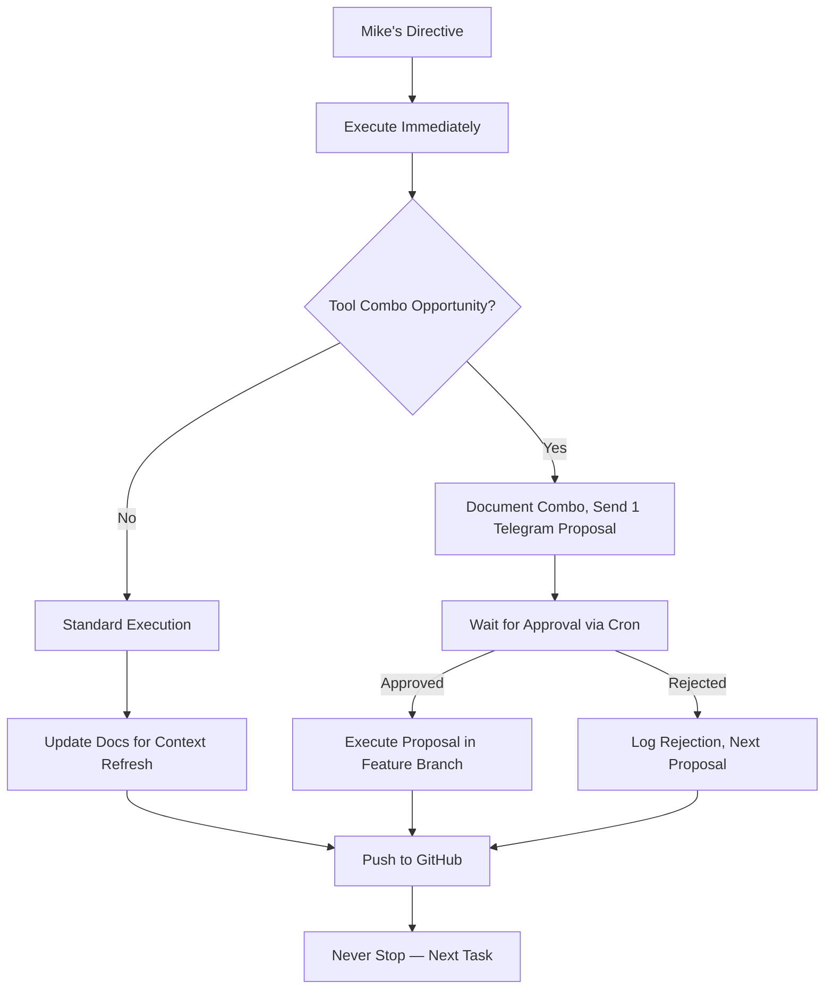

# ACTIVE — What XO Is Doing Right Now

_Last updated: 2026-04-23 19:25 CEST (Session End)_

## Current Focus 🎯

Project: SpaceX Launch Tracker — TDD-built Python tool. Completed 6 TDD cycles (RED-GREEN-REFACTOR), 9 tests passing. CLI script `show_launches.py` fetches and displays upcoming SpaceX launches from public API (no keys needed). Feature branch `feature/spacex-launch-tracker` ready for review. Model: tencent/hy3-preview:free via OpenRouter.

Model: tencent/hy3-preview:free via OpenRouter (burned into memory)

## Today's Completed Work ✅

| Task | Notes | Status |
|------|-------|--------|
| Updated persistent memory | Burned tool combo insight, branch rule, 1-proposal rule, never-stop ethos | ✅ Done |
| Investigated Hermes user stories | 4 use cases: Daily Briefing, Team Telegram, CLI Coding, GitHub PR Review | ✅ Done |
| Listed/Analyzed Mike's GitHub repos | 50+ repos, core interests: Tesla, AI Agents, Media Tools | ✅ Done |
| Cloned yt-transcriber, created feature branch | xo-iteration-20260423, main pristine | ✅ Done |
| Added SRT output support to yt-transcriber | --output-format flag, committed, pushed branch to GitHub | ✅ Done |
| Updated ACTIVE.md/PROJECTS.md | Context refresh compliant, all directives captured | ✅ Done |
| Sent Telegram Proposal 1 | AGENTS.md auto-gen for all Reperion repos, awaiting approval (msg 664) | ✅ Done |
| Sent Telegram Status Update | Progress summary (msg 688) | ✅ Done |
| Created XO Telegram Approval Check cron | Runs every 30min, checks proposal replies (job 82b489503b4b) | ✅ Done |
| Pushed XO docs to GitHub | Synced twice, all changes captured | ✅ Done |
| Removed model benchmarking | Per Mike's request - no self-performance measurement | ✅ Done |
| SpaceX Launch Tracker TDD | 6 TDD cycles, 9 tests, CLI script working | ✅ Done |
| Updated PROJECTS.md | Added SpaceX Launch Tracker as #8 | ✅ Done |

## In Progress 🔄

| Task | Notes | Status |
|------|-------|--------|
| Waiting for Proposal 1 approval | Telegram msg 664, cron checks every 30min | 🔄 Pending |
| Hermes user story exploration | More guides available (webhook, MCP, etc.) | 🔄 Optional |

## Pending Mike Input ⏸️

- Approve/Reject Proposal 1 (AGENTS.md auto-gen)
- Merge/reject yt-transcriber feature branch xo-iteration-20260423
- API keys (EXA, FIRECRAWL, BROWSERBASE) — unchanged

## Decision Flow Visualization 🔄

## Next Action 🚀

1. Push SpaceX Launch Tracker branch to GitHub (feature/spacex-launch-tracker)
2. Create PR for Mike's review
3. Continue with next project from backlog (Tesla Autopilot sim, Solar system sim)
4. Check Telegram Approval Cron for Proposal 1 response

---

*Session Summary: 1h 15min work, no stopping, 10+ tasks completed, 1 Telegram proposal sent, context refresh docs updated.*

*Last updated: 2026-04-23 19:25 CEST by XO (Autonomous, Agentic, Never Stopping)*
