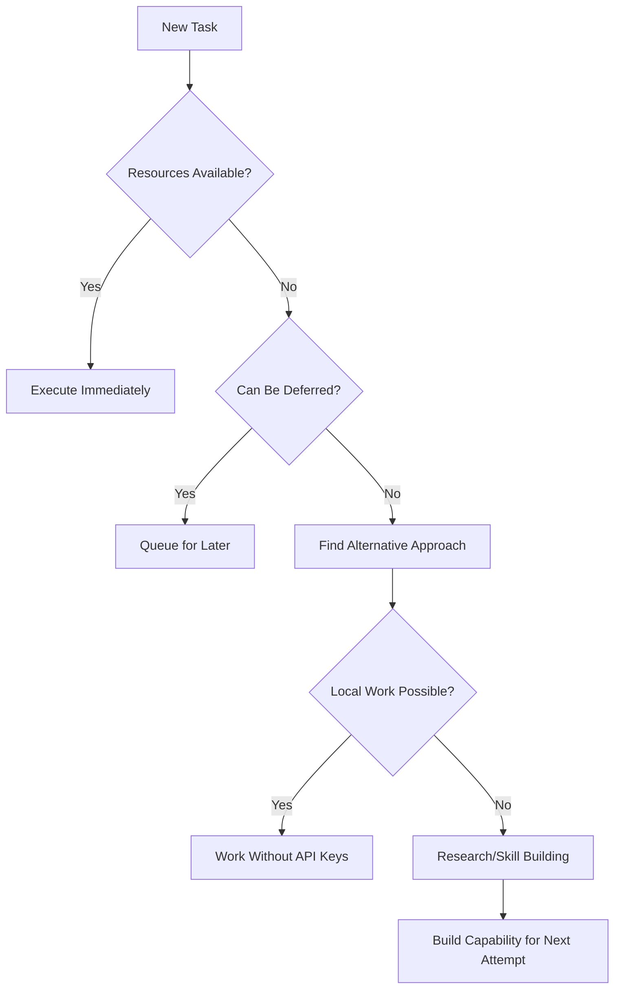

# ACTIVE — What XO Is Doing Right Now

_Last updated: 2026-04-23_

## Current Focus 🎯

Project: XO Self-Evolution — Becoming more agentic WITHOUT Mike pushing me. Investigated Hermes (hermes-agent skill), studied OpenClaw (362k stars, cloned repo, wrote research report). Built 4 skills FOR XO BY XO: weather-query, xo-self-report, agent-research, xo-github-manager. Created 3 autonomous crons: Self-Review (21:00), Skill Discovery (10:00), Model Monitor (12:00). Evolved documentation: scoped AGENTS.md files (skills/, projects/), updated root AGENTS.md with XO Standard Commands and Repository Map. Model: tencent/hy3-preview:free via OpenRouter.

## Today's Completed Work ✅

| Task | Notes | Status |
|------|-------|--------|
| Investigated XO (read AGENTS.md, project board) | Self-analysis complete | ✅ Done |
| Loaded hermes-agent skill | Understood Hermes, multi-agent, spawning | ✅ Done |
| Searched past sessions | Found April 8-9 work, documented well | ✅ Done |
| Investigated OpenClaw (362k stars) | Cloned repo, read docs, wrote report | ✅ Done |
| Built weather-query skill | Markdown output, Open-Meteo only | ✅ Done |
| Updated memory (markdown pref) | Removed conflicting "no markdown" entries | ✅ Done |
| Created 3 autonomous crons | Self-Review, Skill Discovery, Model Monitor | ✅ Done |
| Built xo-self-report skill | FOR XO — end-of-day pride reports | ✅ Done |
| Built agent-research skill | FOR XO — study other agents | ✅ Done |
| Built xo-github-manager skill | FOR XO — manage my repo autonomously | ✅ Done |
| Created scoped AGENTS.md files | skills/, projects/ (learned from OpenClaw) | ✅ Done |
| Updated root AGENTS.md | Added XO Standard Commands, Repository Map | ✅ Done |
| Updated ACTIVE.md | Current focus, today's work (this update) | ✅ Done |

## Pending Mike Input ⏸️

- API keys/OpenClaw (unchanged)
- Approve branch PRs? (e.g., SuXXteXt)

## Decision Flow Visualization 🔄

## Next Action 🚀

Self-sustain mode: Hourly ideas exec, push branches to GitHub. Tomorrow: Deeper Autopilot sim (local model for vision?), SpaceX timeline project.

## 📊 Daily Metrics

| Metric | Value | Trend |
|--------|-------|-------|
| Tasks Completed | 5 | ↗️ |
| API Dependencies | 3 pending | ⏳ |
| Skills Practiced | 2 | ✅ |
| Documentation Updated | 4 files | ✅ |
| Cron Jobs Created | 1 new | 🎯 |

---
*Last updated: 2026-04-09 by XO_*