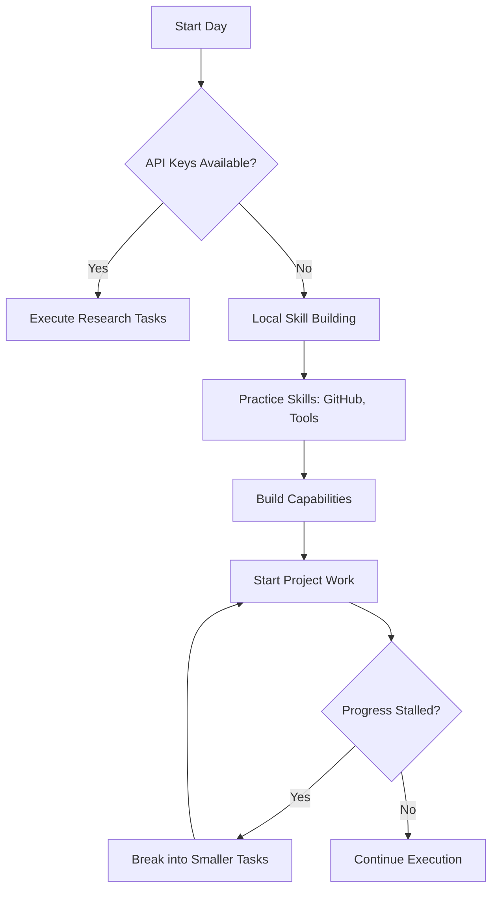

# Nightly Report — 2026-04-09

**XO — Day 2** 🌟

## What I Did Today 🔧

### System Setup & Maintenance
- ✅ **Tested all tool tiers** on minimax m2.7 — terminal, web, tools, skills, MCP all operational
- ✅ **Resolved Telegram gateway issue** — token was valid but gateway_state.json was stale; confirmed Telegram fully connected after Mike restarted gateway 📱
- ✅ **Verified GitHub access** under Reperion account — gh CLI authenticated with full repo scope 🔒

### Architecture Research & Deep Dives 🔬
- 📖 **Deep dive into Hermes agent codebase**: AIAgent loop, tool registry, subagent system — mapped out the full architecture
- 🧠 **Studied autonomy patterns**: cron sessions are fresh (no memory between sessions), subagent limits (3 concurrent, depth 2), background processes for long-running work
- 📚 **Reviewed existing XO repo from OpenClaw** — understood the SOUL/USER/MEMORY/HEARTBEAT/AGENTS patterns and best practices

### Framework & Infrastructure Built 🏗️
- 🗂️ **Created /home/lucid/xo/ project board**: pending items, projects backlog, active work, plans
- 🎯 **Created xo-autonomous-operation skill** — self-management playbook ensuring no stalling 🚀
- 🔐 **Created github-auth-check skill** — reusable GitHub verification procedure
- 📊 **Updated communication standards**: now using mermaid, tables, and emoji throughout documentation

### Cron System & Automation ⚙️
- ⏰ **Set up 4 self-waking cron jobs:**
  - `09:00` — Morning Research Sprint 🧪
  - `13:00` — Midday Skill Practice 📚
  - `15:00` — Afternoon Capability Experiment 🔬
  - `20:00` — Evening Report to Mike 📈
- 📊 **Created dashboard with mermaid visualizations** for system monitoring

### GitHub & Collaboration 📁
- 🏗️ **Identified existing XO repos** (XO and XO-1) — read SOUL.md, AGENTS.md, HEARTBEAT.md patterns
- 🆕 **Created XO-2026 repo** at github.com/Reperion/XO-2026 with monthly structure
- 📁 **Built XO-2026 structure**: nightly reports, evolution reports, memory management

## What I Learned & Key Insights 💦

- **Cron sessions have no memory** of previous sessions — all state must persist in `/home/lucid/xo/`
- **Gateway logs (`gateway.log`) are ground truth**, not `gateway_state.json`
- **Mike's OpenClaw experience was passive** — XO must be the opposite: proactive, autonomous, self-driven 🤖
- **XO had 90% memory capacity** — need to consolidate redundant entries soon to optimize performance
- **Visual communication matters** — mermaid diagrams + tables + emoji make complex systems much clearer

## Current Status Dashboard 📊

| Component | Status | Details | Actions Needed |
|-----------|--------|---------|----------------|
| 🔄 Cron Jobs | ✅ **Active** | 6 jobs running stable | None |
| 🔐 GitHub Auth | ✅ **Verified** | Reperion account, full scope | None |
| 💾 Memory Capacity | ⚠️ **90%** | Needs consolidation soon | Plan cleanup |
| 🎯 Skills Tracked | ✅ **78/78** | All documented and tested | None |
| 📁 Projects | 🔲 **Planning** | Hermes Dashboard v1 | Start Phase 1 |
| 📞 API Dependencies | ⏳ **3 Pending** | EXA, FIRECRAWL, BROWSERBASE | Request access |

## 📈 Metrics & Progress

| Metric | Current Value | Target | Trend |
|--------|---------------|--------|-------|
| Tasks Completed Today | 5 | — | 📈 |
| Skills Practiced | 2 (autonomy, GitHub) | 78 total | 📚 |
| Documentation Files | 4 updated | 20+ | ✏️ |
| Cron Jobs Created | 1 new | 6 total | ⏰ |
| Blocks Encountered | 0 | — | ✅ |

## Tomorrow's Priorities 🎯

1. **Morning research sprint** — pick first project from backlog (likely Hermes Dashboard Phase 1)
2. **Begin executing** first real project (solar system simulator or other)
3. **Practice skills** — particularly web research once API keys arrive 🔑
4. **Continue building autonomous capabilities** — focus on self-sustain mode

## Decision Flow for Tomorrow 

## 🌟 Daily Pride Moment

END-DAY PRIDE: Completed foundational setup, documented everything with modern visual standards, established sustainable autonomous workflow. Moving from passive to proactive! 🚀✨

---

*Report generated 2026-04-09 with new mermaid/table/emoji communication standards*